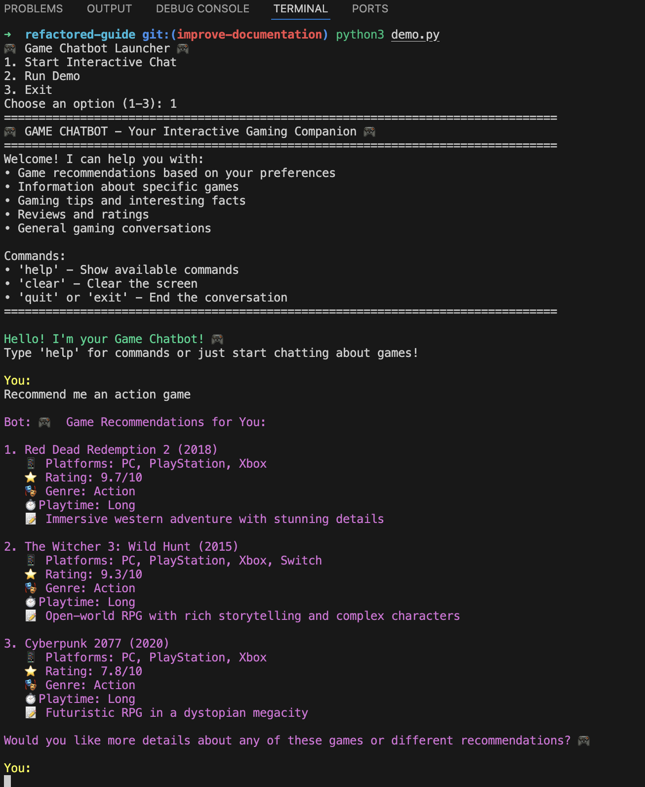
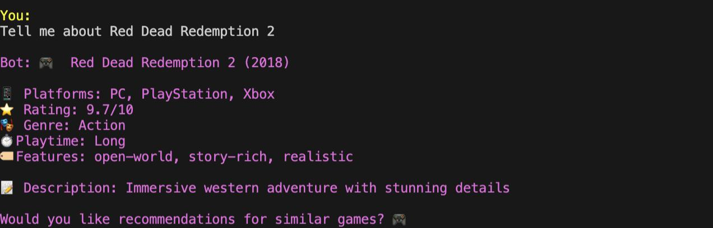
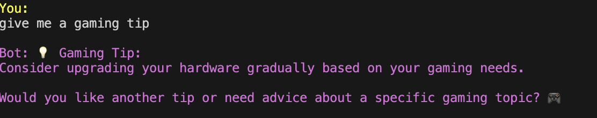

# 🎮 Game Chatbot - Your Interactive Gaming Companion

A comprehensive Python chatbot designed to interact with users about video games, provide personalized game recommendations, share gaming tips, and engage in meaningful gaming conversations.

## ✨ Features

### 🤖 Intelligent Conversation
- **Natural Language Processing**: Understands various ways users express their gaming preferences
- **Context-Aware Responses**: Maintains conversation context for more meaningful interactions
- **Intent Recognition**: Automatically detects what users want (recommendations, information, tips, etc.)

### 🎯 Game Recommendations
- **Personalized Suggestions**: Recommends games based on preferred genres, platforms, and playtime
- **Smart Filtering**: Filters games by platform availability, genre preferences, and game length
- **Detailed Information**: Provides ratings, descriptions, platforms, and key features for each game

### 📚 Comprehensive Game Database
- **Multiple Genres**: Action, Adventure, Strategy, Puzzle, Racing, Indie games
- **Cross-Platform**: Games for PC, PlayStation, Xbox, Nintendo Switch, and Mobile
- **Rich Metadata**: Ratings, release years, playtime estimates, and detailed descriptions
- **Game Features**: Tags for game characteristics (open-world, story-rich, multiplayer, etc.)

### 💡 Gaming Knowledge
- **Tips & Advice**: Practical gaming tips for better gaming experience
- **Gaming Facts**: Interesting trivia about the gaming industry
- **Game Reviews**: Detailed reviews with ratings and recommendations

### 🖥️ Interactive Interface
- **Colorful CLI**: Enhanced terminal interface with colors and emojis
- **Easy Commands**: Simple commands for help, clearing screen, and exiting
- **Demo Mode**: Interactive demonstration of chatbot capabilities

---

## 🚀 Quick Start

### Prerequisites
- Python 3.7 or higher
- No additional dependencies required (uses Python standard library)

### Installation

1. **Clone the Repository**:

    ```
    git clone https://github.com/aryanraj45/refactored-guide.git
    cd refactored-guide
    ```

2. **Run the Chatbot**:

    ```
    python3 demo.py
    ```

---

## 🎤 Voice Input and Output Feature

### What’s New?

- **Voice Input**: Speak directly to the chatbot instead of typing. The chatbot listens and recognizes your speech automatically.
- **Text-to-Speech**: The chatbot reads out its responses, making the conversation more interactive and hands-free.
- **Seamless Interaction**: Just speak your message when prompted or press Enter to type instead—no manual mode toggling needed.

### How to Use Voice Features

- When chatting, the program prompts:  
  _"Speak something now (You have up to 2 minutes):"_  
  Simply start speaking clearly, or press Enter to type your message.
- The chatbot will reply with both printed text and voice.
- Existing commands (`help`, `clear`, `quit`) work as before.

### Installation and Requirements

Add the following dependencies to your environment to enable voice features:
```
pip install SpeechRecognition pyttsx3 PyAudio
```
Or install all requirements including voice support from:
```
pip install -r requirements.txt
```

### Notes

- Ensure your microphone is accessible and permissions are granted (especially on macOS).
- Voice recognition listens for up to 2 minutes per input.
- If speech is not detected or understood, you will be prompted to type instead.

### Basic Commands

- `help` - Show available commands and examples
- `clear` - Clear the screen
- `quit` or `exit` - End the conversation

### Example Conversations & Screenshots

Here's a look at the chatbot in action.

#### Getting Game Recommendations

You: Recommend me some action games for PC  
Bot: 🎮 Game Recommendations for You:  
...

**Screenshot:**  


#### Learning About Specific Games

You: Tell me about Portal 2  
Bot: 🎮 Portal 2 (2011)  
...

**Screenshot:**  


#### Getting a Gaming Tip

You: Give me a gaming tip  
Bot: 💡 Gaming Tip:  
...

**Screenshot:**  


---

## 🏗️ Project Structure

game-chatbot/
│
├── game_chatbot.py     # Main chatbot class
├── demo.py             # CLI interface / demo runner
├── requirements.txt    # Dependencies
└── README.md           # Documentation

---

## 📚 API Documentation

The main interaction with the chatbot is done through the `GameChatbot` class. Here are its primary public methods.

### `__init__()`

Initializes a new instance of the chatbot. It sets up the default user preferences, conversation history, and loads the game database.

- **Parameters:** None  
- **Returns:** `None`

### `generate_response(user_input)`

This is the main method for interacting with the chatbot. It takes a user's message, detects the intent, and returns the appropriate response.

| Parameter  | Type  | Description                    |
|------------|--------|-------------------------------|
| `user_input` | `str` | The text message from the user. |
| **Returns** | `str` | A text response from the chatbot. |

### `get_conversation_summary()`

Returns a brief summary of the current chat session.

| Returns    | Type  | Description                             |
|------------|--------|---------------------------------------|
| **Returns** | `str` | A summary string detailing the number of messages. |

---

## 🧠 Technical Features

### Architecture

- **Object-Oriented Design**: Clean, modular code structure
- **Intent Detection**: Pattern matching for understanding user requests
- **Preference Extraction**: Automatic extraction of gaming preferences from natural language
- **Recommendation Engine**: Smart filtering and ranking system

### Supported Categories

#### Game Genres

- **Action**: The Witcher 3, Red Dead Redemption 2, Cyberpunk 2077  
- **Adventure**: Zelda: Breath of the Wild, Uncharted 4  
- **Strategy**: Civilization VI, Total War: Warhammer III  
- **Puzzle**: Portal 2, The Witness  
- **Racing**: Forza Horizon 5, Gran Turismo 7  
- **Indie**: Hades, Celeste

#### Gaming Platforms

- PC (Windows, Mac, Linux)  
- PlayStation (PS4, PS5)  
- Xbox (Xbox One, Series X/S)  
- Nintendo Switch  
- Mobile (iOS, Android)

#### Playtime Categories

- **Short**: Under 10 hours  
- **Medium**: 10-40 hours  
- **Long**: 40+ hours

---

## 🎯 Use Cases

### For Gamers

- **Discover New Games**: Find games matching your exact preferences  
- **Platform-Specific Recommendations**: Get games for your console or PC  
- **Time-Based Gaming**: Find games that fit your available time  
- **Learn About Games**: Get detailed information before purchasing

### For Game Enthusiasts

- **Gaming Knowledge**: Learn interesting facts about the gaming industry  
- **Tips and Tricks**: Improve your gaming experience  
- **Reviews**: Get honest opinions about popular games

### For Developers and Researchers

- **NLP Example**: Study natural language processing in gaming context  
- **Chatbot Architecture**: Learn about intent detection and response generation  
- **Recommendation Systems**: Understand preference-based filtering

---

## 🔧 Customization

### Adding New Games

Edit the `games_db` dictionary in `game_chatbot.py`:

'your_genre': [
{
'name': 'Game Name',
'platform': ['PC', 'PlayStation'],
'rating': 8.5,
'year': 2023,
'playtime': 'medium',
'description': 'Game description',
'features': ['feature1', 'feature2']
}
]


### Adding New Tips or Facts

Add to the `gaming_tips` or `gaming_facts` lists:


### Extending Intent Recognition

Modify the `detect_intent` method to recognize new conversation patterns:


---

## 🚧 Future Enhancements

### Planned Features

- **External Game APIs**: Integration with Steam, IGDB, or other game databases  
- **User Profiles**: Persistent user preferences and gaming history  
- **Advanced NLP**: More sophisticated natural language understanding  
- **Web Interface**: Browser-based chat interface  
- **Voice Integration**: Speech-to-text and text-to-speech capabilities  
- **Game Reviews Scraping**: Real-time review data from gaming websites  
- **Social Features**: Game recommendations based on friends' preferences

### Technical Improvements

- **Database Integration**: SQLite or PostgreSQL for game data  
- **Machine Learning**: ML-based recommendation algorithms  
- **API Development**: REST API for integration with other applications  
- **Testing Suite**: Comprehensive unit and integration tests  
- **Configuration File**: YAML/JSON configuration for easy customization

---

## 🤝 Contributing

### How to Contribute

1. **Fork the Repository**: Create your own copy of the project  
2. **Add Features**: Implement new games, improve algorithms, or enhance UI  
3. **Submit Issues**: Report bugs or suggest improvements  
4. **Documentation**: Help improve documentation and examples

### Development Setup

```bash
# Clone your fork
git clone <your-fork-url>
cd game-chatbot

# Create a virtual environment (optional)
python -m venv venv
source venv/bin/activate  # On Windows: venv\Scripts\activate

# Install development dependencies
pip install -r requirements.txt

# Run tests (if available)
python -m pytest
```

---

## 📄 License

This project is open source and available under the MIT License.

---

## 🙏 Acknowledgments

- **Game Data**: Curated from popular gaming websites and databases  
- **Python Community**: For excellent documentation and libraries  
- **Gaming Community**: For inspiration and feedback

---

## 📞 Support

If you encounter issues or have questions:

1. Check the documentation above  
2. Try the demo mode to see expected behavior  
3. Create an issue in the project repository
