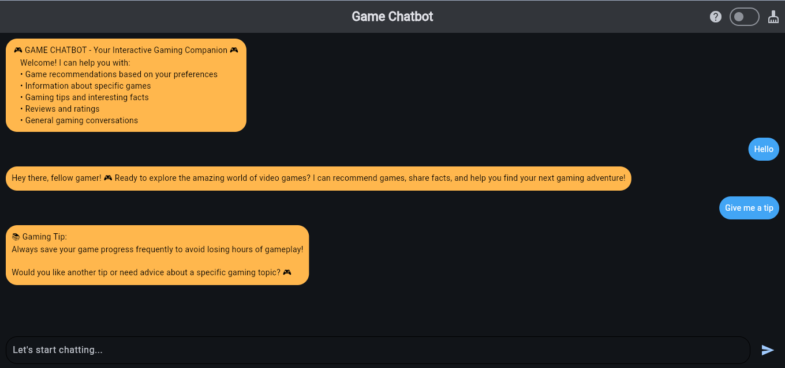
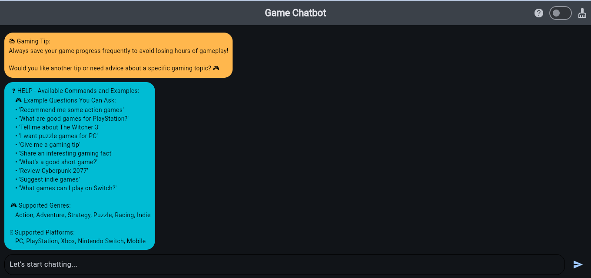

# 🧩 Flet GUI Enhancement for Game Chatbot  
*Contributed by [Ashutosh Agarwal](https://github.com/Ashutosh-agarwal2004)*

## 🧠 Overview
This document explains the new **Flet-based graphical interface** added to the Game Chatbot project.  
It provides an interactive, emoji-supported, and user-friendly GUI experience.

---

## ✨ Features Added

- 🌈 **Emoji Rendering** — Added emoji font (Noto Emoji) and rendering support  
- 💬 **Flet Chat UI** — Created a new graphical interface using Flet  
- 🧍‍♂️ **Message Alignment** — User messages appear on the right, chatbot replies on the left  
- 🪶 **Bottom Text Field** — Input box fixed at bottom for easy access 
- 💡 **Buttons** — Added button for help, theme change, clear screen
- ⚙️ **Emoji Font License Integration** — Included SIL Open Font License and attribution

---

## 🚀 How to Run the Flet App

### 1. Install dependencies
```bash
pip install flet
```

### 2. Run the Flet UI
You can run the **Chatbot GUI** in two modes:
###💻Desktop Mode
```bash
flet run chatbot_gui.py
```

###🌐Web Mode
```bash
flet run --web chatbot_gui.py
```

This will open a GUI window for the chatbot.

---

## 🏗️ Project Structure (New Files Added)

```
├── chatbot_gui.py.py           # Flet-based GUI interface
├── assets/
│   ├── fonts/       # Contains emoji font files (Noto Emoji)
│   └── Screenshot/            # Demo screenshots
```

---

## 📷 Screenshot

### 🌐WEB UI 




---

## 📄 Emoji Font License

This project includes emoji font assets for rendering:

- **Source:** [Noto Emoji](https://github.com/googlefonts/noto-emoji)  
- **License:** [SIL Open Font License 1.1](https://openfontlicense.org/)  
- **Note:** Used under their original open license for UI compatibility.

---

## 👤 Contributor

**Ashutosh Agarwal**  
💻 [GitHub](https://github.com/Ashutosh-agarwal2004)  
📧 [ashutosh.agarwal2004@gmail.com]  
🎮 Passionate about Python, Flet, and AI
